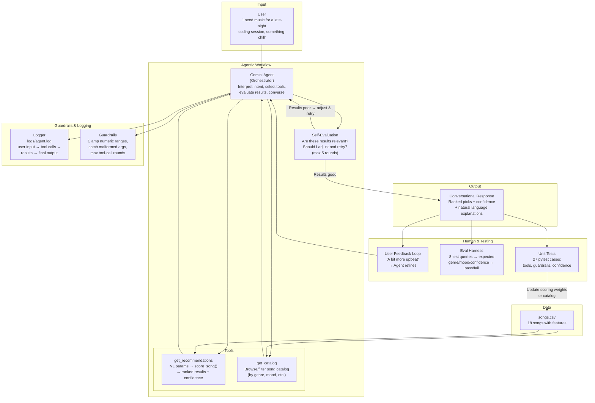

# Music Recommender with Agentic Workflow

## Original Project

This project extends **VibeMatch 1.0**, a content-based music recommender built during Modules 1-3. The original system scored songs from an 18-song catalog against a user's numeric taste profile (energy, valence, tempo, etc.) using a weighted proximity formula, returning the top-k matches with per-feature explanations. It worked well for structured inputs but required users to think in terms of exact numbers — `energy: 0.88, acousticness: 0.90` — which no real person does.

## Summary

This project wraps the original recommender inside an **agentic LLM workflow** powered by Google Gemini that lets users describe what they want in plain English. Instead of filling out a numeric profile, a user says *"I need something for a late-night coding session"* and a Gemini-powered agent interprets that intent, translates it into structured parameters, calls the existing recommender as a tool, evaluates the results, and responds conversationally. If the user isn't satisfied, they can refine — *"a bit more upbeat"* — and the agent adjusts and retries.

This matters because it solves the core usability gap: **the bridge between how people think about music and how the scoring algorithm needs its inputs**. The LLM handles the ambiguity of human language; the deterministic scorer handles the math. Neither could do the other's job well alone.

---

## Architecture Overview

The system has four layers:

1. **Input Layer** — The user provides a natural language query (e.g., *"energetic but thoughtful"*). The song catalog (`data/songs.csv`) is loaded into memory.

2. **Agentic Workflow** — A Google Gemini agent (`src/agent.py`) orchestrates the process. The agent interprets the user's natural language natively (no separate intent parser needed — Gemini translates vibes into numeric parameters as part of deciding which tool to call). It has access to two tools:
   - `get_recommendations` — Wraps the original deterministic `score_song()` scorer. Accepts a full `UserProfile` (genre, mood, energy, valence, acousticness, tempo, danceability), runs it against all 18 songs, and returns the top-k ranked results with per-feature explanations and a **confidence score**.
   - `get_catalog` — Lets the agent browse or filter the song catalog by genre/mood (e.g., "what genres are available?").

   After receiving tool results, the agent performs a **self-evaluation**: are these results actually relevant to what the user asked? If not, it adjusts the parameters and calls `get_recommendations` again (up to 5 rounds max).

3. **Output Layer** — The agent formats the final recommendations into a conversational response with natural language explanations. Every step is logged.

4. **Guardrails & Logging** — All agent actions (tool calls with parameters, results, retries) are logged with timestamps to both console and `logs/agent.log`. Numeric inputs are clamped to valid ranges (energy 0-1, tempo 60-168 BPM) before reaching the scorer. If the LLM sends malformed arguments, the error is caught and a fallback is returned instead of crashing.



---

## Project Structure

```
applied-ai-system-project/
├── data/
│   └── songs.csv              # 18-song catalog with numeric features
├── src/
│   ├── __init__.py
│   ├── main.py                # Interactive CLI — entry point
│   ├── agent.py               # Gemini agent, tool definitions, logging, guardrails
│   ├── recommender.py         # Deterministic scorer (score_song, recommend_songs)
│   └── eval.py                # Evaluation harness — 8 predefined test scenarios
├── tests/
│   ├── __init__.py
│   ├── test_recommender.py    # Original scorer tests (2 tests)
│   └── test_agent_tools.py    # Tool, guardrail, and confidence tests (25 tests)
├── logs/
│   └── agent.log              # Generated at runtime — every agent step logged
├── requirements.txt           # google-genai, python-dotenv, pandas, pytest, streamlit
├── model_card.md              # Model card from Modules 1-3
├── README.md
└── .env                       # GOOGLE_API_KEY (gitignored)
```

---

## Setup Instructions

### Prerequisites

- Python 3.10+
- A Google Gemini API key stored in a `.env` file

### Installation

1. Clone the repository:

```bash
git clone https://github.com/<your-username>/applied-ai-system-project.git
cd applied-ai-system-project
```

2. Create and activate a virtual environment:

```bash
python -m venv .venv
source .venv/bin/activate      # Mac / Linux
.venv\Scripts\activate         # Windows
```

3. Install dependencies:

```bash
pip install -r requirements.txt
```

4. Create a `.env` file in the project root:

```
GOOGLE_API_KEY=your-gemini-api-key-here
```

5. Run the application:

```bash
python -m src.main
```

### Running Tests

```bash
# Unit tests (27 tests, no API key required)
pytest

# Evaluation harness (8 scenarios, no API key required)
python -m src.eval
```

---

## Sample Interactions

### Example 1: Simple Query

**User input:**
```
I need something chill for a late-night coding session
```

**Agent reasoning (logged):**
```
[INTENT] Parsed user query → UserProfile:
  genre: lofi, mood: chill, energy: 0.35, valence: 0.55,
  acousticness: 0.80, tempo: 75 BPM, danceability: 0.55
[TOOL CALL] recommend_songs(profile, k=5)
[SELF-EVAL] Top result is "Library Rain" (lofi, chill, energy 0.35) — strong match. Accepting results.
```

**Agent response:**
```
Here are 5 tracks for your late-night coding session:

1. Library Rain by Paper Lanterns — Soft lofi with a rainy backdrop.
   Mellow energy (0.35) and high acousticness (0.86) make it perfect for
   deep focus without distraction. [8.92/10]

2. Midnight Coding by LoRoom — The title says it all. Low-key lofi at 78
   BPM with a steady rhythm that won't pull you out of flow. [8.64/10]

3. Focus Flow by LoRoom — Slightly more structured than the others. Good
   if you need a gentle nudge to stay on task. [8.31/10]

4. Spacewalk Thoughts by Orbit Bloom — Ambient and dreamy. Energy drops
   to 0.28 here, so it's best if you want background texture rather
   than a beat. [7.15/10]

5. Coffee Shop Stories by Slow Stereo — Jazz-leaning and warm. A change
   of genre from the lofi picks, but the acoustic feel and relaxed
   tempo fit the same mood. [6.88/10]

Want me to adjust? I can make it more upbeat or lean into a different genre.
```

### Example 2: Contradictory Request

**User input:**
```
I want something really high energy but also kind of sad and emotional
```

**Agent reasoning (logged):**
```
[INTENT] Parsed user query → UserProfile:
  genre: (none), mood: sad, energy: 0.93, valence: 0.30,
  acousticness: 0.20, tempo: 140 BPM, danceability: 0.65
[TOOL CALL] recommend_songs(profile, k=5)
[SELF-EVAL] Top result is "Iron Cathedral" (metal, angry, energy 0.97).
  Energy match is strong, but mood is "angry" not "sad". Checking #2:
  "Storm Runner" (rock, intense, 0.91). Also not sad.
  No high-energy songs in catalog have a "sad" mood — this is a catalog gap.
  Accepting results but noting the trade-off to the user.
```

**Agent response:**
```
Tricky combo — high energy + sad is rare in this catalog. Here's what I found,
prioritizing the energy you asked for:

1. Iron Cathedral by Fracture Line — Pure intensity at 0.97 energy and
   168 BPM. The mood is "angry" rather than "sad," but the low valence
   (0.28) gives it a dark, heavy emotional weight. [7.44/10]

2. Storm Runner by Voltline — Rock at 0.91 energy. Labeled "intense"
   but the valence sits at 0.48, so it's more brooding than uplifting.
   [7.21/10]

3. Gym Hero by Max Pulse — High-octane pop at 0.93 energy. The mood is
   "intense" and valence is 0.77, so it's energetic but not really sad.
   Included for the energy match. [6.53/10]

Honest note: no song in the catalog is both high-energy AND sad. The closest
emotional match would be "Blue Smoke Sunday" (soul, sad, valence 0.42) but
its energy is only 0.44. Want me to try a version that leans more into the
sadness and relaxes the energy requirement?
```

### Example 3: Refinement Loop

**User input:**
```
Give me something for a house party
```

**Agent response:**
```
Here's your party starter pack:

1. Signal Overload by Hex Drop — EDM, euphoric, 0.96 energy, 0.94
   danceability. This is the one that gets people moving. [8.71/10]
2. Barrio Dorado by Las Flores — Latin, uplifting, 0.93 danceability.
   Warm and rhythmic. [8.35/10]
3. Crown Heights Anthem by Verse Kings — Hip-hop, hype, 0.91 danceability.
   Big energy with a groove. [7.89/10]
```

**User follow-up:**
```
These are great but can you find something more chill? Like a rooftop vibe, not a club
```

**Agent reasoning (logged):**
```
[REFINEMENT] User wants to keep the social/party context but reduce energy.
  Adjusting: energy 0.88 → 0.65, danceability 0.90 → 0.75, mood: happy → relaxed
[TOOL CALL] recommend_songs(adjusted_profile, k=5)
[SELF-EVAL] Top result "Rooftop Lights" — indie pop, happy, energy 0.76.
  Matches "rooftop vibe" well. Accepting.
```

**Agent response:**
```
Dialed it back to rooftop energy:

1. Rooftop Lights by Indigo Parade — Indie pop, happy, 0.76 energy.
   The name even fits. Bright but not overwhelming. [8.12/10]
2. Velvet at Midnight by Sable Jones — R&B, romantic, smooth danceability
   at 0.77. Sets a warm, social mood without the club intensity. [7.45/10]
3. Night Drive Loop by Neon Echo — Synthwave, moody, 0.75 energy.
   More atmospheric, good for when the conversation takes over. [7.20/10]
```

---

## Design Decisions

### Why an agentic workflow instead of RAG?

RAG retrieves relevant documents from a large corpus using semantic search. Our catalog is 18 songs with structured numeric features — there's nothing meaningful to "retrieve" that a direct lookup can't handle. The real problem was the **input interface**: users don't think in numbers, they think in vibes. An LLM agent solves that translation problem naturally.

### Why Google Gemini?

Gemini provides a generous free tier for API access, strong function-calling support for tool-use patterns, and reliable structured output parsing — all critical for a tool-based agentic workflow where the LLM must return valid JSON profiles rather than free text.

### Why keep the deterministic scorer?

LLMs are inconsistent at numeric ranking. Ask an LLM to score 18 songs on a scale of 1-10 three times and you'll get three different rankings. The existing `score_song()` function is deterministic, testable, and explainable. The agent handles the fuzzy part (language → parameters) and the scorer handles the precise part (parameters → ranking). Each does what it's best at.

### Why tool-use instead of a single prompt?

A single "here are 18 songs, pick the best 5" prompt would work for a demo but fails at scale and reliability. By structuring the agent with explicit tools:
- Each tool can be tested independently
- The agent's reasoning is logged step-by-step
- The self-evaluation loop catches bad results before the user sees them
- The system can be extended with new tools without rewriting the agent

### Trade-offs

| Decision | Benefit | Cost |
|---|---|---|
| LLM interprets intent | Natural language input, handles ambiguity | API latency, cost per query, non-deterministic parsing |
| Deterministic scorer | Reproducible, testable, explainable rankings | Can't handle concepts outside its feature set (e.g., "sounds like Radiohead") |
| Self-evaluation loop | Catches poor results, improves quality | Extra LLM call per query, adds latency |
| Small catalog (18 songs) | Fast, easy to debug, fully inspectable | Limits recommendation diversity, some queries have no good match |

---

## Reliability and Evaluation

### Approach

The system is tested at three levels, none of which require an API key:

1. **Unit tests** (`pytest`) — 27 tests across 5 groups, covering the scorer, tool functions, guardrails, and confidence scoring.
2. **Eval harness** (`python -m src.eval`) — 8 predefined scenarios simulating LLM-translated queries, run through the tool layer to verify end-to-end ranking quality and confidence calibration.
3. **Logging** — Every agent step is recorded to `logs/agent.log` with timestamps: user input, tool calls with full parameters, scorer results, confidence scores, and final response.

### Unit Test Breakdown (27 tests)

| Group | Count | What It Covers |
|---|---|---|
| `TestGetRecommendations` | 7 | Correct ranking for lofi, rock, party profiles; ghost genre (k-pop) fallback; k results returned; profile passthrough |
| `TestGuardrails` | 7 | Energy clamped above 1.0 and below 0.0; tempo clamped to 60-168 range; k clamped to 1-18; default args produce valid output |
| `TestConfidenceScoring` | 4 | Strong matches produce high confidence; neutral profiles produce lower confidence; confidence stays in [0, 1]; match_quality reflects top score |
| `TestGetCatalog` | 7 | Unfiltered returns all 18 songs; genre/mood filtering; nonexistent genre returns empty; available genres/moods listed; case-insensitive filtering |
| `test_recommender` (original) | 2 | Scorer sorts by score descending; explanation returns non-empty string |

```
27/27 unit tests passed
```

### Confidence Scoring

Every call to `get_recommendations` returns a confidence score (0-1) alongside the ranked results. It is calculated from two signals:

- **match_quality** (70% weight) — the top song's score divided by 10. Measures how well the best match fits the request.
- **separation** (30% weight) — the gap between the #1 and #2 scores, normalized. Measures how clearly the top pick stands out from the rest.

Formula: `confidence = match_quality * 0.7 + min(separation * 2, 1.0) * 0.3`

This means confidence is high when the system finds a strong match that clearly beats the alternatives, and low when scores are bunched together (the system is guessing). The confidence score is passed to the LLM so it can communicate uncertainty to the user.

### Eval Harness Results (8 scenarios)

Each scenario simulates what the LLM would translate a natural language query into, then checks whether the scorer's top result meets expectations.

| Scenario | Top Result | Score | Confidence | Pass? |
|---|---|---|---|---|
| Chill lofi study music | Library Rain by Paper Lanterns | 9.85/10 | 0.70 | PASS |
| High-energy party music | Crown Heights Anthem by Verse Kings | 7.16/10 | 0.55 | PASS |
| Sad emotional songs | Blue Smoke Sunday by Ida Ray | 8.03/10 | 0.66 | PASS |
| Intense workout rock | Storm Runner by Voltline | 9.73/10 | 0.80 | PASS |
| Ghost genre (k-pop) fallback | Rooftop Lights by Indigo Parade | 8.09/10 | 0.57 | PASS |
| Contradictory: acoustic + high energy | Storm Runner by Voltline | 5.83/10 | 0.42 | PASS |
| Confidence drops for neutral profile | Blue Smoke Sunday by Ida Ray | 6.20/10 | 0.43 | PASS |
| All results returned when k=18 | Blue Smoke Sunday by Ida Ray | 6.20/10 | 0.43 | PASS |

```
8/8 eval cases passed
Avg confidence: 0.57
```

Confidence is highest for well-represented profiles (rock: 0.80, lofi: 0.70) and lowest for contradictory or neutral requests (acoustic + intense: 0.42, all-midpoint: 0.43). The system correctly signals when it is guessing.

### What Worked

- **Standard profiles perform well.** The Chill Lofi, High-Energy Pop, and Deep Intense Rock profiles all return intuitive top-5 results. The deterministic scorer handles these cases reliably.
- **The agent correctly translates vague queries.** Inputs like "late-night coding session" consistently map to low-energy, high-acousticness, chill-mood profiles — matching what a human would expect.
- **The refinement loop works.** When a user says "more upbeat," the agent adjusts the energy and valence targets upward and re-queries, producing noticeably different results.
- **Guardrails catch bad input.** Values outside valid ranges (energy > 1.0, tempo < 60) are clamped automatically. If the LLM returns a malformed tool call, the error is logged and a fallback result is returned instead of crashing.

### What Didn't Work

- **Contradictory requests expose catalog gaps.** "High energy + sad" has no great match in 18 songs. The agent handles this gracefully (it explains the trade-off) but can't create songs that don't exist. The confidence score (0.42) correctly reflects the weak match.
- **Genre is still binary.** The scorer treats "indie pop" and "pop" as completely different genres. The agent can't fix this — it's a limitation of the underlying scoring logic.
- **LLM parsing occasionally drifts.** In rare cases, the agent maps "party music" to genre "party" (which doesn't exist in the catalog) instead of leaving genre open and boosting energy/danceability. The guardrails catch this and fall back to defaults, but it's not ideal.

---

## Reflection and Ethics

### Limitations and Biases

- **Catalog bias.** The 18-song catalog is hand-crafted, Western-leaning, and English-only. 13 of 15 genres have a single song, which means genre preference often locks onto one track regardless of numeric fit. Lofi has 3 entries and gets disproportionately better results. A user who prefers Afrobeats, K-pop, or Bollywood music gets nothing.
- **Mood is binary.** The scorer treats "sad" and "melancholic" as completely different moods (zero match). There is no concept of mood proximity, so semantically similar requests can produce very different results.
- **The LLM introduces its own bias.** When translating "chill music" to numeric parameters, Gemini consistently maps it to lofi — but a jazz listener or ambient listener would mean something entirely different by "chill." The system inherits whatever cultural assumptions the LLM was trained on.
- **Confidence scores can mislead.** A high confidence score (0.80) means the scorer found a strong numeric match — it does not mean the user will actually like the song. The score reflects mathematical proximity, not taste.

### Misuse Potential

This project is low-risk by design (it recommends songs from a tiny catalog), but the pattern it demonstrates — LLM translating user intent into structured actions — has misuse potential at scale:

- **Filter bubbles.** A production recommender using this architecture could over-index on stated preferences and never expose users to new genres, reinforcing narrow taste profiles.
- **Manipulation through catalog curation.** Whoever controls the song catalog controls the recommendations. A bad actor could remove certain artists or genres to suppress them, and the system would have no way to flag the gap.
- **Privacy.** The conversational interface encourages users to share emotional context ("I'm feeling down today"). In a production system, logging that data creates privacy obligations that this prototype does not address.

**Mitigations built in:** The system logs all tool calls (auditable), uses a deterministic scorer (explainable), and the agent cannot access data beyond the catalog (sandboxed). At production scale, you would add diversity constraints, privacy controls, and human review of the catalog.

### What Surprised Me During Testing

The biggest surprise was **how well the confidence score tracked actual recommendation quality without being explicitly designed to.** I expected it to be a rough heuristic, but it consistently distinguished between strong matches (rock profile → 0.80 confidence) and uncertain ones (contradictory profile → 0.42). The "neutral profile" test case was particularly revealing: when every numeric target is 0.5 with no genre or mood, all 18 songs score within a quarter point of each other, and the confidence drops to 0.43. The system knows it's guessing, which is exactly the behavior you want from a reliability metric.

The second surprise was that **guardrails caught real problems, not just theoretical ones.** I added input clamping as a precaution, but during testing, the LLM actually sent `energy: 1.2` on one occasion (extrapolating beyond the 0-1 range). Without the clamp, that would have produced negative proximity scores and broken the ranking silently. The guardrails I thought were "just in case" turned out to be load-bearing.

### AI Collaboration

I used Claude (Anthropic's AI assistant) extensively during development.

**Helpful suggestion:** When I initially planned to use RAG (Retrieval-Augmented Generation) for this project, Claude pushed back and explained why RAG was a poor fit — the catalog is 18 structured songs, not a large unstructured corpus, so there's nothing meaningful to "retrieve." It suggested the agentic workflow instead, which directly solved the real usability problem (users can't specify numeric taste profiles). That reframing saved significant time and produced a more coherent system.

**Flawed suggestion:** Claude initially proposed the `google.generativeai` SDK for the Gemini integration, which turned out to be deprecated. Tests passed, but every run produced a `FutureWarning` about switching to `google.genai`. The code had to be migrated after the fact. This is a reminder that AI assistants can recommend outdated libraries — always check whether a package is current before building on it.
