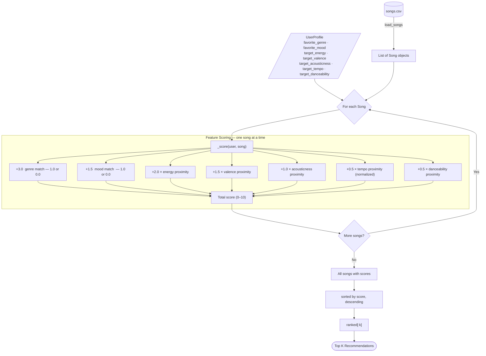

# 🎵 Music Recommender Simulation

## Project Summary

In this project you will build and explain a small music recommender system.

Your goal is to:

- Represent songs and a user "taste profile" as data
- Design a scoring rule that turns that data into recommendations
- Evaluate what your system gets right and wrong
- Reflect on how this mirrors real world AI recommenders

This simulation implements a **content-based music recommender**. Given a user's taste profile — preferred genre, mood, and numeric targets for energy, valence, acousticness, tempo, and danceability — the system scores every song in an 18-song catalog and returns the top *k* closest matches. Each recommendation includes a per-feature score breakdown explaining exactly why a song was surfaced. There is no multi-user data or collaborative filtering; recommendations are derived entirely from song attributes and a single user profile.

---

## How The System Works

### Song Features

Each `Song` in `data/songs.csv` carries 9 attributes:

| Feature | Type | What it captures |
|---|---|---|
| `genre` | categorical | Musical style (pop, lofi, rock, jazz, metal, etc.) |
| `mood` | categorical | Emotional context (chill, intense, happy, sad, etc.) |
| `energy` | float 0–1 | Perceptual intensity — low for ambient, high for metal |
| `valence` | float 0–1 | Musical positiveness — high = happy, low = dark/sad |
| `danceability` | float 0–1 | Rhythm regularity and beat strength |
| `acousticness` | float 0–1 | Confidence the track uses acoustic instruments |
| `tempo_bpm` | float 60–168 | Beats per minute — normalized before scoring |

---

### User Profile

Each `UserProfile` stores a target value for every scored feature:

```python
UserProfile(
    favorite_genre="lofi",       # categorical target
    favorite_mood="chill",       # categorical target
    target_energy=0.40,          # numeric target, 0–1
    target_valence=0.60,         # numeric target, 0–1
    target_acousticness=0.80,    # numeric target, 0–1
    target_tempo=78.0,           # numeric target, in BPM
    target_danceability=0.60,    # numeric target, 0–1
)
```

---

### Algorithm Recipe

Every song is scored out of **10 points** using a weighted combination of feature matches.
Categorical features use exact match (full points or zero). Numeric features use a
**proximity formula** — the closer the song's value is to the user's target, the higher the score.

```
Proximity score = 1.0 − |song.feature − user.target|
Tempo is normalized to 0–1 before proximity is applied: (bpm − 60) / (168 − 60)
```

| Feature | Weight | Method |
|---|---|---|
| Genre match | **3.0** | Exact match: 1.0 or 0.0 |
| Energy proximity | **2.0** | `1 − \|song − target\|` |
| Mood match | **1.5** | Exact match: 1.0 or 0.0 |
| Valence proximity | **1.5** | `1 − \|song − target\|` |
| Acousticness proximity | **1.0** | `1 − \|song − target\|` |
| Tempo proximity | **0.5** | Normalized, then `1 − \|song − target\|` |
| Danceability proximity | **0.5** | `1 − \|song − target\|` |
| **Total** | **10.0** | |

Genre carries the most weight because it is the strongest and most stable user preference.
Energy is weighted second because it has the widest spread across the catalog and is the
most intuitive dimension users listen along. Mood and valence are weighted equally because
they both describe emotional tone — mood as a label, valence as a continuous signal —
and together they provide redundancy that improves robustness.

---

### Data Flow

```
INPUT                        PROCESS                         OUTPUT
──────────────────────────────────────────────────────────────────────
songs.csv                    for each Song:                  scored songs
    │                          _score(user, song)                │
    ▼                            ├─ genre match?   +3.0          ▼
List[Song]  ──────────────►      ├─ energy prox    +2.0      sorted desc
                                 ├─ mood match?    +1.5          │
UserProfile ──────────────►      ├─ valence prox   +1.5          ▼
                                 ├─ acoustic prox  +1.0      ranked[:k]
                                 ├─ tempo prox     +0.5          │
                                 └─ dance prox     +0.5          ▼
                                        │                Top K Songs
                                   sum → score/10
```



---

### Potential Biases

- **Genre over-prioritization.** At 30% of the total score, a genre mismatch is a 3-point
  penalty that no combination of numeric features can fully overcome. A jazz song that
  perfectly matches a user's energy, mood, and valence targets will still rank below a
  mediocre genre match. Users with niche or cross-genre taste are underserved.

- **Catalog size amplifies genre bias.** With only 18 songs, some genres appear once
  (metal, classical, soul). A user whose favorite genre is metal will always get the same
  top result regardless of their numeric preferences, because there is only one metal song
  to rank.

- **Mood is a hard boundary.** Like genre, mood scoring is all-or-nothing. A "melancholic"
  song scores zero for a "sad" user profile even though the two moods are nearly identical
  in meaning. The system has no concept of mood proximity.

- **Static profile, no context.** The same `UserProfile` is used for every query. A user
  who wants chill music at 11pm and intense music during a workout cannot express that.
  Real recommenders adjust by time-of-day and session context; this one cannot.

- **Valence and mood double-count emotional tone.** Together they represent 35% of the
  score. A user profile that sets both `favorite_mood="happy"` and `target_valence=0.9`
  effectively weights the emotional dimension higher than intended, at the expense of
  energy-related features.

---

## Getting Started

### Setup

1. Create a virtual environment (optional but recommended):

   ```bash
   python -m venv .venv
   source .venv/bin/activate      # Mac or Linux
   .venv\Scripts\activate         # Windows

2. Install dependencies

```bash
pip install -r requirements.txt
```

3. Run the app:

```bash
python -m src.main
```

### Running Tests

Run the starter tests with:

```bash
pytest
```

You can add more tests in `tests/test_recommender.py`.

---

## Experiments You Tried

Use this section to document the experiments you ran. For example:

- What happened when you changed the weight on genre from 2.0 to 0.5
- What happened when you added tempo or valence to the score
- How did your system behave for different types of users

---

## Limitations and Risks

Summarize some limitations of your recommender.

Examples:

- It only works on a tiny catalog
- It does not understand lyrics or language
- It might over favor one genre or mood

You will go deeper on this in your model card.

---

## Reflection

Read and complete `model_card.md`:

[**Model Card**](model_card.md)

Write 1 to 2 paragraphs here about what you learned:

- about how recommenders turn data into predictions
- about where bias or unfairness could show up in systems like this


---

## 7. `model_card_template.md`

Combines reflection and model card framing from the Module 3 guidance. :contentReference[oaicite:2]{index=2}  

```markdown
# 🎧 Model Card - Music Recommender Simulation

## 1. Model Name

Give your recommender a name, for example:

> VibeFinder 1.0

---

## 2. Intended Use

- What is this system trying to do
- Who is it for

Example:

> This model suggests 3 to 5 songs from a small catalog based on a user's preferred genre, mood, and energy level. It is for classroom exploration only, not for real users.

---

## 3. How It Works (Short Explanation)

Describe your scoring logic in plain language.

- What features of each song does it consider
- What information about the user does it use
- How does it turn those into a number

Try to avoid code in this section, treat it like an explanation to a non programmer.

---

## 4. Data

Describe your dataset.

- How many songs are in `data/songs.csv`
- Did you add or remove any songs
- What kinds of genres or moods are represented
- Whose taste does this data mostly reflect

---

## 5. Strengths

Where does your recommender work well

You can think about:
- Situations where the top results "felt right"
- Particular user profiles it served well
- Simplicity or transparency benefits

---

## 6. Limitations and Bias

Where does your recommender struggle

Some prompts:
- Does it ignore some genres or moods
- Does it treat all users as if they have the same taste shape
- Is it biased toward high energy or one genre by default
- How could this be unfair if used in a real product

---

## 7. Evaluation

How did you check your system

Examples:
- You tried multiple user profiles and wrote down whether the results matched your expectations
- You compared your simulation to what a real app like Spotify or YouTube tends to recommend
- You wrote tests for your scoring logic

You do not need a numeric metric, but if you used one, explain what it measures.

---

## 8. Future Work

If you had more time, how would you improve this recommender

Examples:

- Add support for multiple users and "group vibe" recommendations
- Balance diversity of songs instead of always picking the closest match
- Use more features, like tempo ranges or lyric themes

---

## 9. Personal Reflection

A few sentences about what you learned:

- What surprised you about how your system behaved
- How did building this change how you think about real music recommenders
- Where do you think human judgment still matters, even if the model seems "smart"

